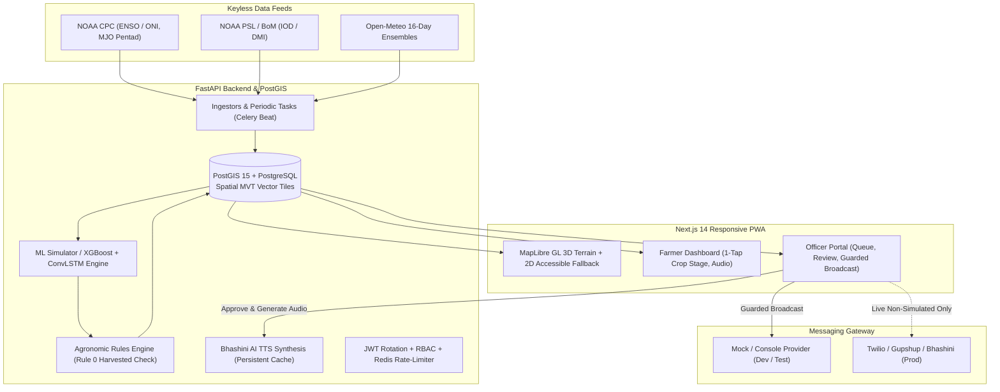

# Pannaga: Hyperlocal Monsoon Onset & Break Prediction System, India

Pannaga is a production-grade, India-wide, full-stack predictive system that generates **1–4 week probabilistic outlooks** of monsoon onset, dry breaks, and heavy downpours at **Block and Gram Panchayat** scale. It converts sub-seasonal climate signals into **crop-specific agronomic advisories** delivered in 6 regional languages to farmers and Agricultural Extension Officers via WhatsApp, SMS, and an offline-resilient mobile web app (PWA).

---

## 1. System Non-Negotiables (Automated Policy Enforcement)

1. **Absolute Data Honesty:** Every forecast, advisory, and notification carries an immutable `data_source` tag (`LIVE` | `HINDCAST` | `SIMULATED`). Simulated data triggers a persistent amber UI banner and is **hard-blocked by code and database constraints from ever reaching real telecom providers** (`NotificationStatus.BLOCKED_SIMULATED`).
2. **Absolute Skill Honesty:** Zero fabricated metrics. The Phase 3 machine learning pipeline is documented honestly as **pipeline-only and untrained** (`is_trained = False`); no phantom AUC-ROC or Brier scores are reported until trained on multi-decadal historical arrays (Phase 8+).
3. **Human-in-the-Loop Governance:** High and critical agronomic advisories require explicit review and digital sign-off by Agricultural Extension Officers prior to outbound broadcast.
4. **Farmer Spam & Alarm Fatigue Protection:** 72-hour cooldown per farmer with a strict **risk escalation exception** (`CRITICAL > HIGH > ADVISORY > INFO`), plus an issuance cap of at most 1 primary + 1 secondary advisory per farmer per cycle.
5. **Production Fail-Safe:** Dev OTP (`000000`) is unconditionally rejected when `ENV=production`. Production refuses to boot if `PUBLIC_BASE_URL` or production secrets are unset.

---

## 2. System Architecture



---

## 3. Quick Start with Docker (Recommended)

### Prerequisites
- Docker Engine $\ge 24.0$ & Docker Compose v2 (no obsolete `version:` top-level key)

### Launch Full Stack
```bash
# 1. Clone repository
git clone https://github.com/your-org/pannaga.git
cd pannaga

# 2. Configure environment
cp .env.example .env

# 3. Build and launch all services
docker compose -f infra/docker-compose.yml up -d --build

# 4. Verify system readiness
curl -s http://localhost:8000/readyz
```

The stack exposes:
- **Web App / Map PWA:** [http://localhost:3000](http://localhost:3000)
- **FastAPI OpenAPI Docs:** [http://localhost:8000/docs](http://localhost:8000/docs)
- **PostGIS 15:** `localhost:5432` (`pannaga` / `pannaga`)
- **Redis 7:** `localhost:6379`

---

## 4. Local Development Without Docker

### Prerequisites
- Python 3.11 with [`uv`](https://github.com/astral-sh/uv)
- Node.js 20 with [`pnpm`](https://pnpm.io/)
- PostgreSQL 15 with PostGIS 3.4
- Redis 7

### 1. Database Setup
```bash
createdb pannaga
psql -d pannaga -c "CREATE EXTENSION IF NOT EXISTS postgis;"
```

### 2. Backend Setup (`/backend`)
```bash
cd backend
uv sync --extra dev
cp ../.env.example .env

# Run database migrations and seed data
uv run alembic upgrade head
uv run python scripts/seed_data.py

# Launch FastAPI development server
uv run uvicorn app.main:app --host 0.0.0.0 --port 8000 --reload
```

### 3. Frontend Setup (`/frontend`)
```bash
cd frontend
pnpm install
cp ../.env.example .env.local

# Launch Next.js development server
pnpm dev
```

---

## 5. Automated Verification & Testing

Pannaga enforces strict regression testing across all tiers:

```bash
# ─── 1. Backend Pytest Suite (80 Automated Tests) ───────────────────────────
docker compose -f infra/docker-compose.yml exec backend uv run --extra dev pytest tests/ -v

# ─── 2. Frontend Unit Tests (Vitest) ─────────────────────────────────────────
docker exec -t pannaga-frontend npm run test

# ─── 3. OpenAPI Schema Drift Check ───────────────────────────────────────────
docker exec -t pannaga-frontend npm run gen:api:check

# ─── 4. TypeScript & ESLint Checks ───────────────────────────────────────────
docker exec -t pannaga-frontend npm run typecheck
docker exec -t pannaga-frontend npm run lint

# ─── 5. Playwright E2E & Axe Accessibility Audit (9 Tests) ───────────────────
docker run --rm --net=host \
  -v "$PWD/frontend:/app" \
  -w /app \
  mcr.microsoft.com/playwright:v1.44.0-jammy \
  npx playwright test
```

### Verified Test Scenarios
- **WebGL Resilience:** Tests TerrainMap3D with WebGL active (measures $\ge 15\text{ FPS}$, captures screenshot), and tests 2D accessible fallback when WebGL is disabled.
- **Full-Stack Live Flow:** Real live authentication (`request-otp` $\to$ `verify-otp`), retrieves pending advisory from live backend queue, digital officer approval, physical Bhashini TTS WAV generation, dry-run recipient audit, and confirmed broadcast with simulated blocking.
- **Axe WCAG 2 AA Audits:** Full accessibility audits on `/`, `/farmer`, and `/officer` asserting 0 critical and 0 serious violations (including color-contrast and non-color cues).
- **Rule Boundaries:** Exact threshold tests for false onset ($\ge 0.60$), break ($\ge 0.70$ + duration $\ge 10\text{d}$), heavy rain ($\ge 0.75$), and rule 0 suppression for harvested crops.

---

## 6. Supported Regional Languages

Pannaga provides full user-interface and agronomic advisory support across 6 Indian regional languages:
- **English** (`en`)
- **Hindi** (`hi` - हिन्दी)
- **Marathi** (`mr` - मराठी)
- **Kannada** (`kn` - ಕನ್ನಡ)
- **Telugu** (`te` - తెలుగు)
- **Punjabi** (`pa` - ਪੰਜਾਬੀ)

Number, unit, and calendar date validation checks re-validate all machine translations to protect numerical agricultural guidance.

---

## 7. Documentation & References

- [Methodology & Probability Semantics](docs/methodology.md): Meteorological criteria, 1-4 week forecast windows, and agronomy decision logic.
- [Model Card](docs/model_card.md): Model architecture, feature space definitions, and data honesty declarations.
- [Operational Runbook](docs/runbook.md): Deployment, monitoring, incident response, and troubleshooting procedures.
- [OpenAPI Schema](frontend/openapi.json): Machine-readable API contract.
